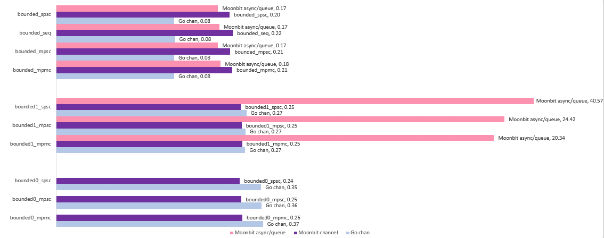

# Bench

## Run CMD

```bash
go run ./examples/bench/go.go
moon run --target native ./examples/bench/main.mbt
```

## Environment

- Hardware: Apple M4 Mac mini (24G)
- OS: macOS 15.7.3
- Go: `go1.25.5 darwin/arm64`
- MoonBit: `moon 0.1.20260123 (b4c72f8 2026-01-23)`


## Result


Use log axis

### Go

limit to one thread

```
bounded0_mpmc             Go chan           0.365 sec
bounded0_mpsc             Go chan           0.355 sec
bounded0_spsc             Go chan           0.354 sec
bounded1_mpmc             Go chan           0.268 sec
bounded1_mpsc             Go chan           0.269 sec
bounded1_spsc             Go chan           0.274 sec
bounded_mpmc              Go chan           0.078 sec
bounded_mpsc              Go chan           0.078 sec
bounded_seq               Go chan           0.079 sec
bounded_spsc              Go chan           0.078 sec
```

default multi threads

```
bounded0_mpmc             Go chan           0.756 sec
bounded0_mpsc             Go chan           0.990 sec
bounded0_spsc             Go chan           0.574 sec
bounded1_mpmc             Go chan           0.580 sec
bounded1_mpsc             Go chan           0.762 sec
bounded1_spsc             Go chan           0.424 sec
bounded_mpmc              Go chan           0.129 sec
bounded_mpsc              Go chan           0.100 sec
bounded_seq               Go chan           0.073 sec
bounded_spsc              Go chan           0.109 sec
```

### MoonBit Channel

with (moonbitlang/async@0.16.2) runtime

```
bounded0_mpmc     Moonbit Channel           0.255 sec
bounded0_mpsc     Moonbit Channel           0.251 sec
bounded0_spsc     Moonbit Channel           0.244 sec
bounded1_mpmc     Moonbit Channel           0.254 sec
bounded1_mpsc     Moonbit Channel           0.252 sec
bounded1_spsc     Moonbit Channel           0.249 sec
bounded_mpmc      Moonbit Channel           0.214 sec
bounded_mpsc      Moonbit Channel           0.207 sec
bounded_seq       Moonbit Channel           0.216 sec
bounded_spsc      Moonbit Channel           0.204 sec
```

### MoonBit async/queue

moonbitlang/async@0.16.2
```
bounded0_mpmc     Moonbit @async/Queue      N/A
bounded0_mpsc     Moonbit @async/Queue      N/A
bounded0_spsc     Moonbit @async/Queue      N/A
bounded1_mpmc     Moonbit @async/Queue      20.339 sec
bounded1_mpsc     Moonbit @async/Queue      24.419 sec
bounded1_spsc     Moonbit @async/Queue      40.572 sec
bounded_mpmc      Moonbit @async/Queue      0.175 sec
bounded_mpsc      Moonbit @async/Queue      0.167 sec
bounded_seq       Moonbit @async/Queue      0.171 sec
bounded_spsc      Moonbit @async/Queue      0.167 sec
```
